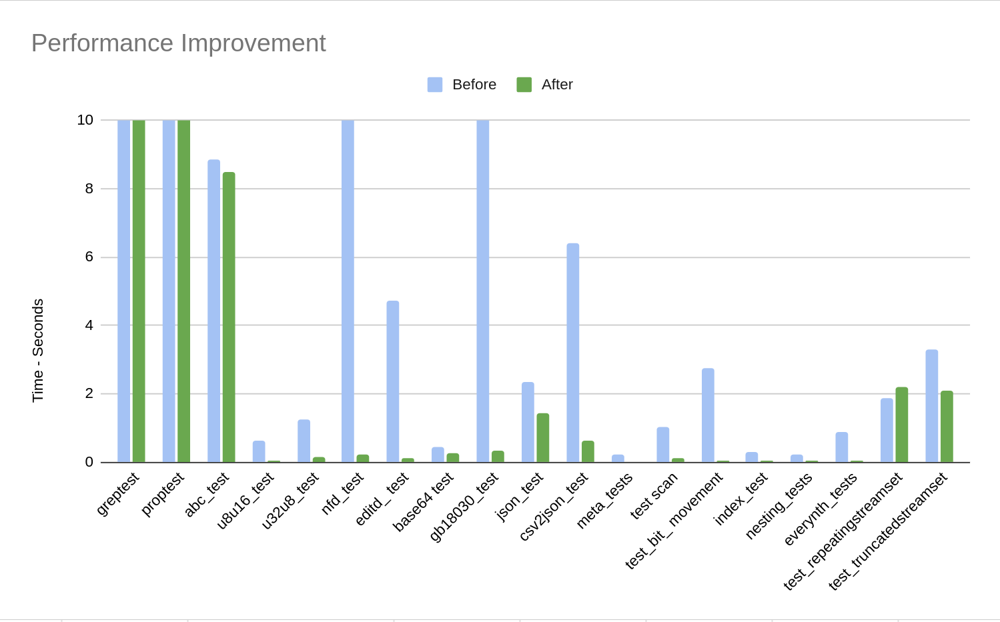
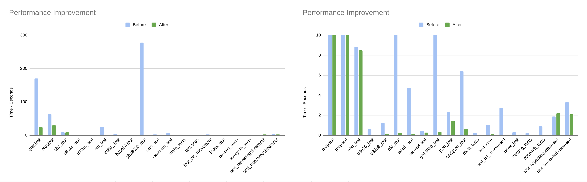
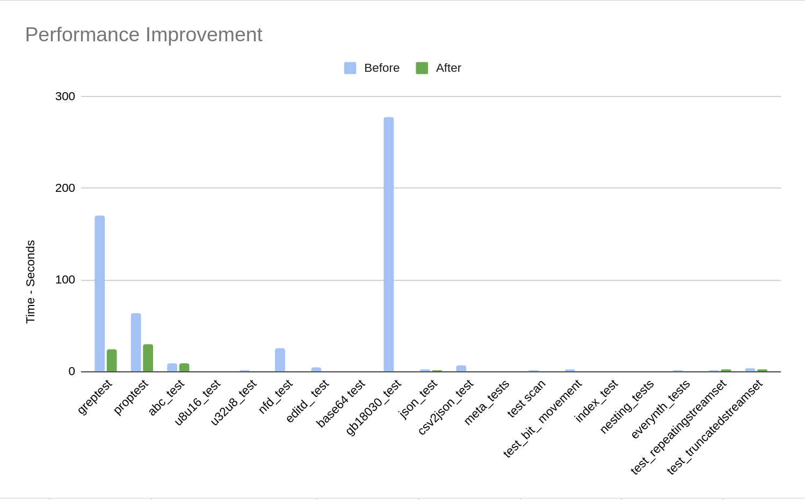
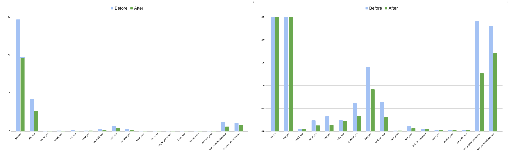

+++
date = '2026-02-01'
draft = true
title = 'Improving Parabix Performance on ARM Architecture'
description = """
Converted from the original LaTeX project report with inline figures and code snippets.
"""
+++

## Abstract

This report details our efforts to improve the performance of Parabix, a parallel bitstream framework,
on ARM architecture. Parabix leverages Single Instruction, Multiple Data (SIMD) parallel processing to achieve gigabit
per second text processing. While Parabix has proven its efficiency on x86 architecture, it did not achieve an 
equivalent performance on ARM due to the need for architecture-specific optimization required to take full leverage 
the different SIMD instruction set. 
In this project we utilize ARM's advanced SIMD extension, NEON, to improve the performance of Parabix 
on ARM. 

We rewrote functions within the `IDISA_ARM_Builder` using NEON intrinsics. 
Compared to the previous implementation we achieved a 58% speedup on QA tests and
demonstrated a 2% to 32% decrease in CPU cycle counts on individual Parabix tools using our performance testing script.

Additionally, we explored the potential of incorporating ARM's Scalable Vector Extension (SVE) into Parabix.
Our research involved creating an experimental `IDISA_ARM_SVE_Builder` and
analyzing the challenges of integrating SVE's vector-width agnostic programming into Parabix's existing architecture.
We propose changes to Parabix's code generation which allow for better support of SVE by decoupling target-specific
implementation concerns.

Our work demonstrates the performance improvements achievable 
through applying NEON intrinsics and lays groundwork for utilizing SVE within Parabix. 

## Introduction

From smartphones to supercomputers, ARM architecture powers an increasingly diverse range of computer devices.
As ARM captures a growing market share across embedded systems, mobile devices, and even high-performance
computing, it is crucial for software to effectively leverage ARM's capabilities. 
While many applications can simply be recompiled for ARM using LLVM, high-performance parallel
processing frameworks like Parabix require architecture-specific optimizations to achieve peak efficiency.

This project aims to improve Parabix performance on ARM through application of ARM's advanced SIMD extension, NEON.
Parabix utilizes SIMD to achieve gigabit-per-second text processing speeds. 
While Parabix has demonstrated impressive efficiency on x86 architectures, its performance on ARM has lagged due
to insufficient use of ARM's unique SIMD instruction set.

NEON offers a powerful set of SIMD intrinsics that can dramatically accelerate parallel computation.
By rewriting functions within Parabix's ARM-specific builder, `IDISA_ARM_Builder`, 
we aim to close the performance gap between the current implementation and what ARM is capable of.
Our approach focused on identifying opportunities where NEON intrinsics could replace inefficient, generic
operations, while also guaranteeing an entirely correct implementation.

This report details our methodology, implementation, and results in optimizing Parabix for ARM. We begin
with an overview of ARM's growing importance and SIMD efficiency, followed by an exploration of
our NEON optimizations. 
We present rigorous performance measurements demonstrating substantial improvements across various
Parabix tools. Additionally, we investigate the potential for incorporating ARM's SVE into Parabix,
laying the groundwork for a future implementation.

Our work not only demonstrates significant performance improvements through ARM NEON optimizations but
also provides insights into adapting Parabix for SVE. By improving Parabix's ARM performance, we extend its
applicability to a wider range of devices and use cases, from efficient text processing on mobile devices
to high-throughput analysis on ARM-based supercomputers.

## Background

### Why ARM?

ARM architecture powers a diverse range of devices, from efficient smartwatches to the most powerful supercomputers .
Designed for efficient computing, ARM is the most popular choice for IoT and embedded devices.
However, its applications extend beyond low-power devices.
The vast majority of smartphones and tablets rely on ARM's efficiency to perform power intensive tasks while 
maintaining a long battery life.

Currently 13% of laptops are powered by ARM, it is estimated that by 2025 ARM will capture 21% of the market .

ARM isn't only efficient for portable devices. SVE has proven to create efficiency
at the largest scales. For instance, Fugaku, the world's fastest supercomputer from 2020 to 2022, utilized SVE 
to surpass all other supercomputers..
It is clear that the efficiency and customization of ARM architecture allows it to excel across a wide range of
computing applications, making ARM ubiquitous.

Parallelism is fundamental to Parabix. ARM's strong support for efficient parallelism through NEON and SVE
creates an opportunity for Parabix to run efficiently on both smartwatches and supercomputers
, something which not feasible on x86. 

### Efficiency of SIMD

SIMD (Single Instruction, Multiple Data) is a parallel computing method where a single instruction operates on 
multiple data points simultaneously, enabling significant speedups compared to scalar execution. 
However, this efficiency can only be realized when the
desired computation is supported by the underlying architecture.

In 2001 ARM introduced the advanced SIMD extension, called *NEON*. 
Unlike previous SIMD implementations, NEON's design allows for easy application to a wide range of problem domains.
Notably this project makes use of NEON intrinsics. Intrinsics are pre-defined, architecture-specific functions that 
map to assembly instructions. This mapping eliminates the need for the translation that occurs with a generic function.
Intrinsics also provide the compiler with context that assembly instructions alone do not have. Overall, NEON
intrinsics enable programmers with a simple way to implement high efficiency computation.

## Project Goals

Our primary objectives are to improve the performance of Parabix on ARM architecture,
ensure the correctness of its implementation, and extend its functionality to leverage
the NEON instruction set

### Starting State

In 2022, an attempt was made to write an ARM specific builder for Parabix.
Their ARM builder, `IDISA_ARM_Builder`, was an adaptation of the already existing `IDISA_SSE_Builder`.
The adaptation used many architecture-agnostic functions which resulted in an inefficient and sometimes incorrect implementation.

### Desired State

Given this initial state, our primary goals were to ensure a completely correct implementation 
and to utilize ARM-native features to improve efficiency. These objectives go hand-in-hand, as
ARM NEON provides a set of intrinsics that are both guaranteed to be correct and highly efficient.

To achieve these goals, we planned to utilize the existing QA test suite to verify correctness 
of our changes. Each run of the test suite also reported the duration of each test, providing
a general idea of efficiency improvements. However, for more accurate statistics, we planned 
to create a performance testing script. The script would run a small subset of Parabix's
tools multiple times while recording wall-clock time and CPU cycle counts. 
Allowing for an accurate understanding of our improvements.

Finally, after successfully applying NEON intrinsics, we planned to explore the viability
of using NEON's SVE to achieve further performance increase.

## Project Design

### Build and Execution Environments

Building Parabix for ARM presented the challenge of running ARM architecture on our x86 machines.
Without access to ARM hardware we planned to use the emulator QEMU . QEMU offers a complete 
ARM system emulation allowing us to to execute ARM binaries, even with ARM specific extensions like SVE, on x86 hardware.

### IDISA_ARM_Builder

In Parabix, operations such as a vector shuffle are first defined in an architecture-agnostic way. This ensures that
Parabix can run on any architecture LLVM supports. However, because these function definitions cannot
utilize architecture-specific features, their implementations are often inefficient.
To address this, Parabix allows specialized architecture-specific builders to override the general implementation.
In particular, the ARM builder overrides how SIMD operations are defined on ARM. 

We researched the available NEON intrinsics and identified candidate matches to the IDISA Builder functions.
For some functions, such as `mvmd_slli`, `mvmd_srli`, and `mvmd_dslli`, LLVM doing the work for us by replacing
the generic calls with NEON intrinsics. Other functions such as `mvmd_compress`, `hsimd_signmask`, and `bitblock_advance`
had no suitable translation into NEON intrinsics, so their implementations were removed from the builder. 

The following are the remaining functions, along with a description of the NEON intrinsics used to implement them:
- `simd_bitreverse` 
    
    `rbit` reverses the bits in each byte of the vector. `rev16` to `rev64` will reverse the bytes within each 16 to 64 bit field. 

- `esimd_mergel` and `esimd_mergeh`
    
    `zip1` and `zip2` provide the same functionality as `merge`.
- `hsimd_packl` and `hsimd_packh`

    `uzp1` and `uzp2` provide the same functionality as `pack`.
- `simd_popcount` 
    
    `cnt` gives a population count for bytes in a vector. `addp` reduces the vector to the appropriate field width and element count. 

### Measuring Improvements

The overarching goal for this project is to demonstrate an improvement in performance so accurately tracking Parabix tool performance
is important. We planned to create a performance testing script 
written in either Bash or Python. The script would run a small subset of Parabix's tools and capture CPU cycle counts using Parabix's debug flags. 

## Implementation

### Development Environments

QEMU's ARM system emulation was accurate but slow.
To mitigate long build times within the emulator, we opted to cross-compile Parabix on our x86 machines. 
However, even running the pre-compiled binaries proved too time-consuming.
To address this, we acquired a Raspberry Pi 5, which uses the Armv8-A processor, enabling us to build and
run Parabix on physical ARM hardware. 

The only downside to using physical hardware over emulation was that Raspberry Pi's SoC, Broadcom BCM2712, opted to 
not include ARM's SVE extension . To work around this we employed QEMU's user-mode emulation to emulate SVE.

All performance results presented in this report were obtained using the Raspberry Pi 5 running Raspberry Pi OS. 

### IDISA_ARM_Builder

To demonstrate the changes made throughout the `IDISA_ARM_Builder` we highlight one function, `esmid_mergel`

#### Previous implementation

`esmid_mergel` was written with generic function calls such as `smid_or`. The implementation was
also not compete as it only handled the special cases where field with was equal to 1 or 2. In all other cases
this function simply called the default builder to do the computation. 
In all cases this function generated inefficient function calls.

#### Our implementation

After researching NEON intrinsics we found one called `zip1` which performs the exact computation needed 
for `esmid_mergel`.
We replaced the previous implementation with a single function which simply calls `zip1`.
The complete function is shown in the code snippet below. Note that our implementation handles the common field width
sizes from 16 to 64, but similar to the previous implementation, calls the default builder when given a field width
outside that range. This is common for all builder functions to ensure that any given field width is correctly computed.
`esmid_mergel` is a fortunate case where a single NEON intrinsic computed the desired computation, 
most functions required the use of multiple intrinsics. 

```cpp
Value * IDISA_ARM_Builder::esimd_mergel(unsigned fw, Value * a, Value * b) {

  if ((fw >= 16) && (fw <= 64) && (getVectorBitWidth(a) == ARM_width)) {

  int nElms = getVectorBitWidth(a) / fw;
  int halfFw = fw / 2;

  Function * zip1_fn = Intrinsic::getDeclaration(getModule(),
    // Call to ARM NEON intrinsic
    Intrinsic::aarch64_sve_zip1,
    FixedVectorType::get(getIntNTy(halfFw), nElms * 2));

  return CreateCall(
    zip1_fn->getFunctionType(),
    zip1_fn,
    {fwCast(halfFw, a), fwCast(halfFw, b)});
  }
  return IDISA_Builder::esimd_mergel(fw, a, b);
}
```

*Rewrite of `esmid_mergel` to use the NEON `zip1` intrinsic.*

The same data is displayed in both figures. The left has a time scale of 30 seconds, the right a 
scale of 2.5 seconds. Note that two tests, `greptest` and `editd_test`, are not included
because they failed in the previous implementation.
This data demonstrates that our changes have a made an improvement in performance 
across every test.


*Results of `make test` before and after our changes.*

### Cycle Counts

Written in Python, the performance testing script calls Parabix tools `icgrep`, `wc`, and `csv2json`
and gives them large files as input.
We pass the debug flag `-EnableCycleCounter` to capture the number of CPU cycles used by each
by each kernel, which is essential for accurately measuring our performance improvements. 
Parabix also automatically caches kernels to improve run time. 
To ensure that successive test with small changes were not affected by what was stored in the cache
and smooth variance in the run times
we used a second debug flag `--enable-object-cache=0` which disables the object cache.

The test script runs each tool 10 times to smooth out variance resulting from CPU and IO caches warming up.
For each run, it captures the cycle counter report
and computes an average of the cycle count totals by kernel across all runs. 
We found that the script gave us
very repeatable measurements.

By our measurements, we reduced the total average cycles used by `icgrep` by 32.4%,
the cycles used by `wc` by 11.4%, and the cycles used by `csv2json` by 2%. GNU
perf measurements showed an increase from 180 MB/s to 283 MB/s IO bandwidth for `icgrep`,
379 MB/s to 571 MB/s for `wc`, and 108 MB/s to 113 MB/s for `csv2json`.

The numbers from `icgrep` and `wc` are encouraging, and we were glad to see that the two
tools used to measure confirm that we're spending less time on each item and so getting through
the entire stream faster. The numbers we measured from `csv2json`, however, are in the noise.
The operations we were able to optimize on ARM platforms -- pack, merge, popcount, etc. -- are operations
that `icgrep` and `wc` both rely heavily on. `csv2json`, however, performs
many deletions and insertions, and relies most heavily on bitwise compress-right and expand-right
(`pext` and `pdep`. Without hardware support these operations are slow on ARM platforms,
and so there was not much we were able to do to improve them.

## Scalable Vector Extensions (SVE)

### SVE Overview

SVE is an optional extension in the ARM architecture introduced in ARMv8.2-A . It allows for
vector registers to be implemented using widths from 128-2048 bits with the only restriction that
the chosen width is some multiple of 128. To support this, SVE defines a vector instruction
set and programming paradigm for writing code that is vector-width agnostic. SVE aims to give hardware
manufacturers some freedom in choosing how wide to implement their processor's vector registers 
while giving software developers the ability to run on any processor that includes SVE regardless
of the actual vector width. In addition to variable-width vector registers, the SVE architecture
adds a set of predicated instructions, gather-loads and scatter-stores, and new instructions for
horizontal vector reduction operations.

SVE's vector width-agnostic programming paradigm is achieved largely through instruction predication
and a set of predicate generation functions. Consider as an example the following simple example:

*Simple loop example pseudocode would usually be quite simple:
load strides of the vector register width into vector registers from `x` and `y`, use
SIMD operations to perform multiplication and addition, and store in strides to `result`.

SVE presents a unique challenge given that we do not know at compile time what the 
vector width will be. We can vectorize the given operations in a vector width-agnostic way by
using two tools given by SVE: first, we can find how big the stride should be using one of the
`cnt*` instructions provided by SVE to get the count of elements in a vector at run-time;
second, we can use either use the runtime vector width to correctly scalaraize the tail or use
vector predication to load and operate on the correct number of elements in the loop's tail. 
SVE provides a set of looping instructions that, given a loop index and
a total number of elements, create a predicate register for different termination conditions.
For example, `whilelt` creates a predicate vector with active elements up to the point 
that the loop index becomes greater than or equal to the total.

The looping strategies presented here illustrate the key way that SVE's vector width-agnostic
programming functions: it relies on moving values that were previously known at compile time to 
run time. This has implications not just on loading, storing, and handling vectors, but also in
computing constant mask values or constant vectors. It's impossible to specify a scalable constant
vector. Instead, they need to be computed at run time.

SVE promises to give performance gains by and increased SIMD throughput, however it has yet to see 
widespread adoption. Apple Silicon's M-series processors do not implement SVE, and it appears that 
the Cortex-A710 ARMv9 processor is among the first Cortex processor to offer SVE, albeit with a vector 
width of only 128 bits. It's difficult to find comprehensive information on chipsets that implement 
SVE, but it appears the cloud computing space is the only space where SVE is easily accessible;
Amazon's ec2 has virtual machine offerings running on their in-house ARM processors with SVE support .

### Scalable Vectors in LLVM

LLVM introduced new types and intrinsics for supporting SVE and scalable vector architectures.
Scalable vectors are written as `<vscale x N x Ty>` where:
- `vscale` is a placeholder for a vector length multiplier known at run time
- `N` is the minimum number of elements of type `Ty` the vector can hold
- `Ty` is the numeric type of the elements of the vector

SVE vectors must be some multiple of 128, so legal SVE vectors could be `<vscale x 16 x i8>`,
`<vscale x 2 x i64>`, or any other vector where `N` times the width of `Ty` equals
128.

## Supporting SVE in Parabix

### Experimental IDISA_ARM_SVE_Builder

Our project submission includes an experimental IDISA Builder targeting SVE. Our builder is quite
minimal; it only implements Parabix pack operations using scalable vector types. It serves only to
prove that we can select the SVE implementation when SVE is available and emit code that uses scalable
vectors. As such, it doesn't support SVE in any practical or performant way. 

*Implementation of the packl function for SVE shows the implementation of the packl function. It converts between the fixed
vector type used elsewhere throughout Parabix and the scalable vector type required to call the SVE
intrinsics provided by LLVM. Inspections of the generated assembly reveal that LLVM scalarizes the loads
and stores; in fact, LLVM loads the scalable vector register a byte at a time. Clearly, this approach
is not ideal.

Our implementation also includes a function pass to try and help LLVM choose to use scalable vectors
when the fixed vectors its using would fit. Our pass adds the `vscale_range` attribute to each
kernel function which hints to LLVM that the scalable vector's `vscale` parameter will be within
the given range and enables it to store fixed vectors in scalable vector registers when legal and
perform optimizations using scalable vector types. In practice, however, we did not find that LLVM
chose to do so.

### Parabix's current code generation architecture

Parabix programs comprise kernels and stream sets. Stream sets, internally, are managed buffers
of data that are loaded into SIMD registers for parallel processing by kernels. Kernels can generate
the machine code to operate on stream sets by using a KernelBuilder to generate LLVM IR directly or
by using a PabloBuilder to generate a Pablo Abstract Syntax Tree (PabloAST). The PabloCompiler will
then use a KernelBuilder to transform the PabloAST into LLVM IR. Parabix is also capable of compiling
regular expressions to machine code capable of matching the expressions against data in a stream set.
Regular expressions are compiled by generating Pablo code that performs the match at compiling it.

The main entry point to the codegen layer is, then, the KernelBuilder. the figure below
shows the inheritance chain culminating in the KernelBuilderImpl class that is consumed by all
higher-level application layers.


*KernelBuilderImpl inheritance tree.*


*Proposed composition-based target codegen architecture.*


## Conclusion

Our project has been quite successful in meeting its goals. We were able to take the existing
ARM implementation and mature it into an implementation that is correct and performant. We did this by 
identifying candidate IDISA operations that would benefit from the set of operations that NEON
supports natively and implementing them using NEON SIMD instructions.
Although not every candidate operation we identified ended up benefiting from NEON, we are satisfied 
with the breath of operations we did implement and we were able to verify for some that LLVM was already
emitting optimal code for the default implementations. We were also able to take good performance 
measurements and quantify what the performance gain was to get a sense of which use cases
benefited the most from our work and which benefited the least. 

Using the time we had left over in the project term we were able to begin investigations into SVE 
and assess how vector width-agnostic programming could be enabled in Parabix in the future. In the course
of this work we identified potential architecture improvements that could be made to Parabix's codegen 
layer to enable easier implementation of support for new target architectures in the future.

### Lessons Learned

Throughout the project, we encountered several valuable lessons and insights. This project and, more
generally, this course has demystified SIMD programming for us. Conceptually, SIMD programming is not 
a difficult thing to understand, but we now understand better how to reason about vectorized code, 
evaluate efficiency, and come up with more optimal solutions to problems. We have also gained a good 
sense of what kind of higher-level code is easily vectorizable by a compiler which will enable us to 
better reason about the performance characteristics of higher-level code and write more performant code 
more often.

Measuring performance was also a big part of our project. Initially when comparing our implementation 
to the previous using `make test` we saw an extreme boost in performance. These 
were part of the results presented in the poster presentation. While these results were true, they 
weren't completely fair. Unlike our performance script `make test` does not circumvent caching. 
After accounting for caching we found that our changes made consistent improvement but not as 
extreme as we initially thought. Further, measuring wall-clock time is not always a meaningful
measure of performance, and a good performance measuring system should look at several different
metrics across several different use cases of the software its measuring to build a more
holistic assessment.

Early in the project we used QEMU to create virtualized ARM enviroments for us to work in.
QEMU is impressively consistent in it's emulation. For example subtle bugs which we encountered 
within emulation were reproduced on hardware. The downside to QEMU was just how slow the system 
emulation was and how long of a development cycle it created. We underestimated how much this would 
hinder our ability to make progress.

Working so closely with LLVM IR presented us with a steeper learning curve to overcome in the early
phases of the project. LLVM IR's similarity to assembly language can sometimes obscure the fact that
it's still a deep abstraction over the machine code you wish it to generate. For our use case, we
wanted LLVM to emit specific sequences of instructions for each operation we implemented. In some
cases that proved difficult. We learned that in these cases we had to instead write code from which
LLVM could easily infer what our intent was; we had to give it more space to "do the right thing".

We're glad to have chosen a project that required us to work so closely with back-end compiler 
technologies. Working at this level and learning the Parabix codebase has helped us understand how 
to go about integrating a back-end into a compiler. The experience gained will serve as a good 
foundation for future compiler projects.

### Future Work

We see little in the way of future improvements that could be made to Parabix's NEON support.
The NEON instruction set is relatively simple as SIMD instruction sets go, and we don't see
much more that can be improved with what it has to offer. We did find that the bitwise 
compress-right and expand-right (pext/pdep) operations were very slow on ARM, however we did not
have enough project bandwidth to dedicate time to improving them. It still may be worth evaluating
other algorithms to perform these operations. Some Parabix tools such as csv2json use these
operations extensively, and for these tools there are big performance gains to be had by
improving the algorithm for architectures where hardware support is unavailable.

Our project submission includes an experimental IDISA SVE Builder that proves that we can detect
the availability of SVE and emit SVE code. As discussed, it does not have usable performance and
could take advantage of more of the features that SVE provides. Further work is needed to build out
and mature the implementation.

To that end, we've also discussed how SVE breaks some of the assumptions made about targets by
Parabix's existing codegen layer and, to a lesser extent, the rest of the Parabix codebase. 
Enabling vector width-agnostic programming in Parabix will mean refactoring the codebase to use
LLVM's VectorType superclass to polymorphically work with both fixed and scalable vectors.

In this report, we have presented a proposed architecture change to Parabix's codegen layer 
to support the effort to support vector width-agnostic programming and to allow more flexibility 
along the axes on which targets may differ. While the proposed updates would require updating many 
parts of the Parabix codebase they should be comparatively simple to implement as they are largely a
reorganizing effort. The efforts to support both SVE and NVPTX 
would both benefit from the proposed changes should they be chosen for adoption. 

### Repository link and note about submission

The repository can be found here: `https://cs-git-research.cs.sfu.ca/sla489/parabix-devel`

Please note that we did not merge our SVE experimentation into the master branch as it is experimental
and unstable. It is located in the repository under the `sve` branch, or the `final-sve` tag.


## Additional Figures from the Source Archive


*AI*


*Perf 10s*


*Perf Both*


*Perf max*


*frog*


*frog2*


*parabix policyarch*


*test both*

