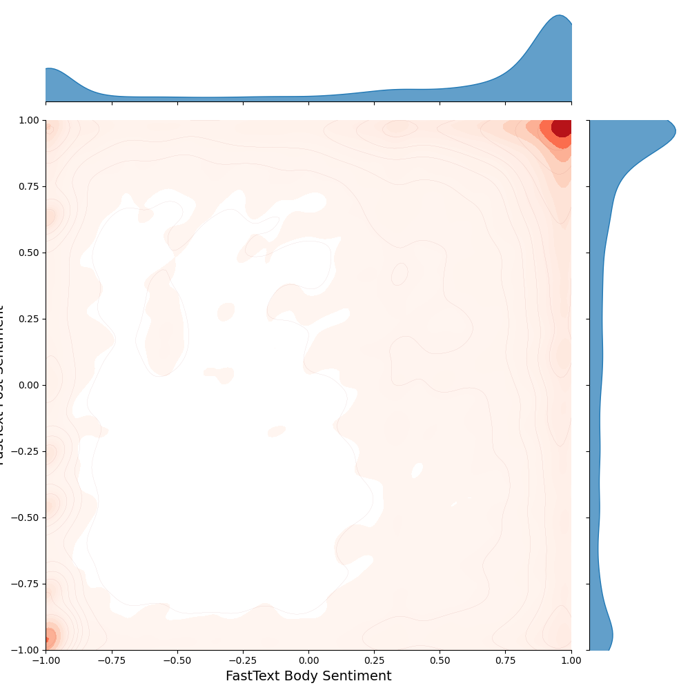

+++
date = '2026-02-01'
draft = false
title = "DeepLearning is expensive. Can we classify users using standard data science methods?"
description = """
Before DL took over data science there was a vast library of alogrithms to takle all sorts of big data questions. Though DL will often give the best results, it's expensive in time and resources. This post explores the viability of more efficent methods on calssifying users within the *Reddit Comment Corpus*.
[Read More](/experience/reddit-small-user-groups-report/)
"""
+++

## Abstract

This report explores whether small groups of Reddit users can be accurately classified using only simple, non-aggregated features from the Reddit Comment Corpus. We engineer new features, including sentiment and NSFW scores, to improve classification. Using a Random Forest model, we test performance on several user groups but find precision and recall to be below 25%. Our results suggest that more complex methods are likely required to achieve high accuracy classification.

## Project Motivation

Say a large social media platform like Reddit is about to implement some large, very expensive model to understand user behaviour. This kind of task usually requires taking into account the complex network affects of tens of millions of users over a million subedits. Clearly this work will require a lot of resources. But is it worth it? Specifically, can we classify user comments without relying on aggregation across multiple posts, time periods, or network connections?

### Precise Question

Equivalently, the question we attempt to answer in this report: Is the Reddit comment corpus expressive enough to classify an arbitrary data point into some known grouping without any form of aggregation.?

## First Look at the Dataset

The Reddit Comment Corpus is a large-scale dataset containing user comments from the Reddit platform. It was created and maintained by researchers to support studies in natural language processing, social media analysis, and other related fields.

The dataset is approximately TODO terabytes in compressed format. The objective of this study is to identify correlations that will be useful for future analyses. To keep the scope manageable, we chose to work only with data from the most recent complete year available, 2023.

However, even one year of data is too large for our current analysis so we randomly selected the month of March as our focus. We decided to use a single month rather than sampling across the entire year because the corpus is Hive partitioned by year and month in the compute cluster. This structure allows us to process data more efficiently when working with a specific partition, rather than accessing approximately 100,000 files at random.

With the March 2023 subset of Reddit comments selected, we proceed by examining the features present in the data.

### Dataset Features

The raw dataset contains a total of 51 features. Among these, `author`, `body`, and `score` are the most straightforward. These features store the username of the commenter, the text of the comment itself, and the score of the comment at the time the data was collected.

The `subreddit` feature identifies the community where the comment was posted. Together, these four features capture the core elements most people think of when they see a Reddit comment: who posted it, what it says, which community it was posted to, and how it is being received.

While knowing the subreddit gives some context to the comment, our simple feature engineering process refines this context further by linking the comment directly to the specific post it responds to.

The remaining 37 features are metadata. Some of these describe the author. For example, certain subreddits allow users to decorate their username with custom text or symbols, which is stored in the `author_flair_richtext` feature. Other metadata fields include timestamps indicating when the comment was created, information about whether the comment was edited, and unique identifiers that link the comment to its parent post or thread.

Other features in the dataset are useful for making API calls or for understanding network effects. The `id` feature stores the unique identifier of the comment, and it can be linked to the `parent_id` feature, which stores the identifier of the comment or post being replied to. This relationship can be used to model the structure of conversations and interactions between users.

### Metadata Features

It is clear that the author’s name, the contents of the comment, the community where it was posted, and the comment’s score all play a major role in understanding the dataset. However, it is also important to examine the remaining features to determine whether they offer additional insight.

Many of these features turned out to be heavily biased toward a single value. For example, the `is_submitter` feature, which indicates whether the author of the comment is also the author of the original post, is biased toward the value *False* approximately 90% of the time. The `can_gild` feature, which indicates whether a comment can receive Reddit Gold awards, is biased toward a single value 98% of the time. Some features, such as `distinguished`, which marks comments from moderators or administrators, are effectively constant in this subset and show a 100% bias toward a single value.

This suggests that, while the dataset contains 51 features, the number of features with meaningful variation is much smaller. Our analysis shows that 61% of the dataset’s variability can be explained if 38 of the features are reduced to a single column containing their dominant value. This is a concerning result because it means that, for any given unique set of variables, roughly half the time the remaining variables will simply match the default values.

To improve the potential for meaningful analysis, it will be necessary to introduce new features that capture additional information and are less biased toward a single value.

*Stacked bar chart showing the extent to which each feature is dominated by a single value, with each value represented by its own colour.*

    

## Simple Feature Engineering

In order to gain more useful insights from the dataset, we created additional features through simple feature engineering. This was done by explicitly identifying patterns that can be found within the existing data and turning them into measurable values.

Starting with the `author` field, we applied simple regular expressions to generate the features `author_char_count` and `author_punct_count`, which record the total number of characters in a username and the amount of punctuation it contains.

We also created the feature `author_is_deleted`, a boolean flag indicating cases where a user has deleted their account but their comments remain visible. This situation occurs in roughly 3% of the dataset. In future analyses, we plan to remove any rows where this flag is set to true.

The same counting methods and the check for the string "[deleted]" were applied to the `body` feature, resulting in six new features being added to the dataset.

We then extended our regex approach to search for patterns with specific meaning. A notable example is the term "throwaway," which Reddit users often include in their usernames to signal that the account is for one-time use. Such accounts are typically used to post personal or sensitive information while keeping it separate from their main account, which may contain personally identifiable information. Using `jq`, we sampled the dataset for usernames resembling this pattern and generated a regular expression that could reliably capture this group.

Another common pattern occurs when Reddit automatically assigns a generated username to new accounts. We identified this pattern and created a feature that distinguishes between accounts with automatically generated names and those with more personalized, unique usernames.

This set of features represents the outcome of our initial round of simple feature engineering. While these new variables add meaningful dimensionality to the dataset by avoiding the bias seen in many of the default features, they alone are not sufficient for strong predictive performance.

*Distribution of new simply engineered features*

## Feature Engineering with Sentiment Analysis

Sentiment analysis is the process of identifying and interpreting the emotional tone of text. Applying sentiment analysis to the text-based features in our dataset allows us to create high-quality features that capture important information about each comment.

Unlike the simple regex-based methods used earlier, extracting sentiment from text requires more computationally intensive techniques. Large Language Models (LLMs) perform exceptionally well at this task, but running them typically requires hundreds of gigabytes of GPU memory.

Since we only had access to a laptop and the shared SFU compute cluster, we chose to use HuggingFace transformer models. These models are typically under one gigabyte in size and can run efficiently on a single laptop while still producing high-quality sentiment predictions.

While sentiment analysis is often focused solely on detecting positive and negative sentiment, we expanded our scope to also capture NSFW sentiment. On Reddit, the “Not Safe for Work” (NSFW) tag is applied to certain communities to warn users that the content may be sexual, violent, or otherwise inappropriate for a public setting.

Focusing only on positive and negative sentiment can be limiting for Reddit data because not all important nuances are tied to emotional polarity. A comment can be neutral in tone yet still contain explicit or sensitive material. By incorporating NSFW sentiment as a separate feature, we ensure that our analysis captures this additional layer of meaning, which is especially relevant for understanding user behaviour and community norms on the platform.

### Applying Transformers

We began by testing several pre-trained HuggingFace transformer models, including `michellejieli/NSFW_text_classifier`, `artin-ha/toxic-comment-model`, and `cardiffnlp/twitter-roberta-base-sentiment-latest`. These models are trained to detect properties such as whether text is NSFW, toxic, or positive.

When applied to a sample of 100,000 comments, these models performed well in obvious cases but often misclassified shorter comments, especially those with very few words. Since roughly half of the comments in the dataset contain fewer than twelve words, many of the resulting sentiment classifications were inaccurate.

To address this, we explored a larger and more flexible model: Facebook’s `bart-large-mnli`. BART is designed for zero-shot classification, meaning it can assign text to categories we define ourselves rather than being limited to predefined sentiment classes. This allowed us to use categories such as `["sexually explicit NSFW", "general discussion"]` or `["toxic hurtful", "positive helpful"]`, making the model adaptable to our specific needs. Testing BART on a sample of 100,000 comments showed that it was significantly more accurate with short text. However, we encountered a bug where any text containing at least two underscores was automatically classified as NSFW. After removing underscores from the input, this issue was resolved, and we moved forward with using BART for the full dataset.

At this point, we ran into another limitation: running BART in a distributed computing environment. Since our compute cluster uses multiple executors, each would need to load the large BART model locally. Despite several attempts, the cluster would stall when trying to load BART, producing no results. This led us to search for smaller, more lightweight sentiment analysis methods that would run efficiently in the cluster environment.

We settled on using two alternative approaches: VADER from the Natural Language Toolkit (nltk) for positive and negative sentiment, and FastText for NSFW sentiment. VADER is a rule-based model that runs much more efficiently than BART, making it well-suited for our setup. For NSFW detection, FastText required training, so we constructed a balanced corpus. We selected 50,000 comments from subreddits whose names contained “NSFW” and another 50,000 comments randomly sampled from non-`restricted` subreddits. Although the dataset contains a `subreddit_type` feature that marks a subreddit as `restricted` when it is 18+, this label does not always correspond to sexual content. By building a targeted corpus, we aimed to train FastText to focus specifically on detecting sexual material rather than any content deemed inappropriate.

Both models were configured to output sentiment scores between -1 and +1. VADER was found to produce a value of 0.0 for 55% of post texts and 37% of comment bodies. This occurs when VADER detects no pull toward positive or negative sentiment, which we interpret as “neutral.” Because this neutral category is so large, we filtered these results before continuing with the analysis of the remaining sentiment data.

The graphs in the figures below show the sentiment analysis results from FastText and VADER, applied to both the comment body and the associated post text.

For FastText, the results are heavily skewed toward a score of +1 in both the body and post text, indicating that the model tends to classify most content as strongly belonging to the positive or NSFW class it was trained for.

When examining VADER sentiment, we first removed all cases where the score was exactly 0.0, as these represent neutral results. After this adjustment, the VADER scores display a clear bimodal distribution, with peaks around -0.5 and +0.5 for both comment body and post text. This produces a roughly four-quadrant pattern when comparing body sentiment to post sentiment.

Overall, the VADER results appear more balanced and may be more useful for improving group classification, as they provide a greater spread of sentiment values rather than concentrating in a single extreme.

*FastText NSFW sentiment scores for comment body and post text. Scores are heavily skewed toward +1 or "not sexual" class in both cases*

*VADER positivity sentiment scores for comment body and post text after removing neutral results. The distribution is bimodal, with peaks near +-0.5 in both cases.*

## Group Prediction

After generating new features from the dataset, we returned to our main goal of determining whether these features could improve our ability to classify specific groups of Reddit users. We focused on three distinct groups: controversial users, throwaway accounts, and accounts with Reddit-generated style usernames.

In the original dataset, the `controversiality` feature is a boolean that is set to true when the number of upvotes is roughly equal to the number of downvotes, and the total number of votes exceeds a certain threshold. Controversial users make up less than 2% of the dataset.

Because most features are heavily skewed and none follow a normal distribution, we chose to use Random Forest Classification rather than statistical methods such as the t-test. This standard machine learning technique builds an ensemble of decision trees from the input features to produce classifications. After training, testing, and tuning the model, initial results were poor, with less than 1% positive case recall and less than 4% positive case precision.

To improve performance, we applied the `imblearn` library, which is designed for handling highly imbalanced datasets. After retraining, the model was able to classify controversial posts with 26% precision, 21% recall, and an F1-score of 0.237.

We then repeated this process for throwaway accounts and Reddit-generated usernames. Throwaway accounts make up less than 0.5% of users and proved indistinguishable from a random sample, with recall around 7%, precision around 2%, and an F1-score of 0.026.

Finally, we tested the model on Reddit-generated accounts, which account for about 8% of the dataset. In this case, the results were similar to the controversial group, with 2% recall, 15% precision, and an F1-score of 0.19.

In all three cases, the Random Forest model identified our engineered features as the most important for classification decisions. However, it is clear that these features alone are not sufficient for achieving high accuracy in distinguishing between the selected user groups.

## Conclusion

The Reddit comment corpus proved to make small group classification a difficult task due to it's highly skewed distribution and low dimensionality.
Through feature engineering we were able to extract better features, however features too were heavily skewed.
Opting to train a RandomForest model on the dataset we were unsuccessfully in creating a model which achieved higher than 25% in either precision or recall on specific groups of Reddit users. 
From our analysis we conclude that more complex methods such as author comment aggregation over time, or deep learning, are required to achieve high confidence is classifying small subsets of Reddit users.

## Conclusion

### Repository link and note about submission

## asside - Aggrigating over sub

## Additional Figures from the Source Archive

*barchart final full*

*sentiment_fasttext_body_vs_post*
